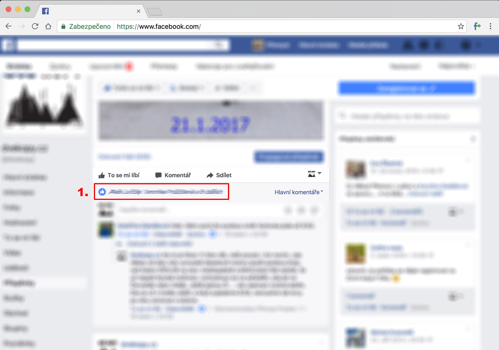
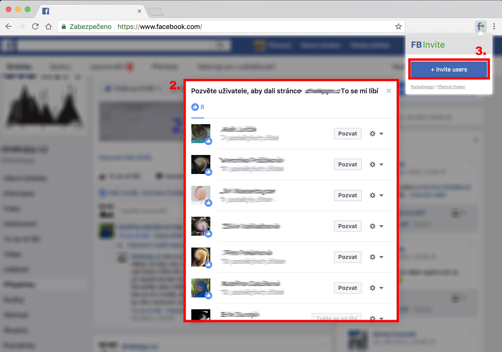

# FBInvite
This plugin allows you to invite all people who liked your post from Facebook dialog with simple click.

# How to use
1. Click on link with people who liked your post
2. Let the dialog appear 
3. Use `+ Invite users` button in the extension
4. Enjoy your free time :)

# How to install
1. Download `download/FBInvite.zip`, unpack and save it to your disk
2. Open Chrome browser with new tab `chrome://extensions` or `Settings > Extensions`
3. Check the `Developer mode` in upper right corner
4. Click `Load unpacked extension...` and locate the directory you just saved
5. FBInvite extension should appear in your extension list